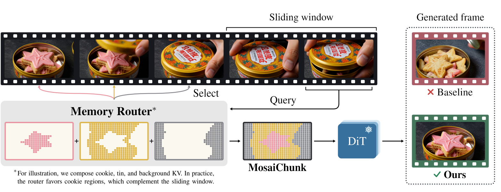
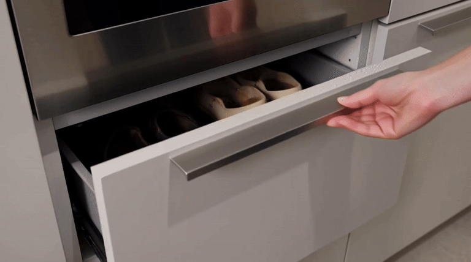
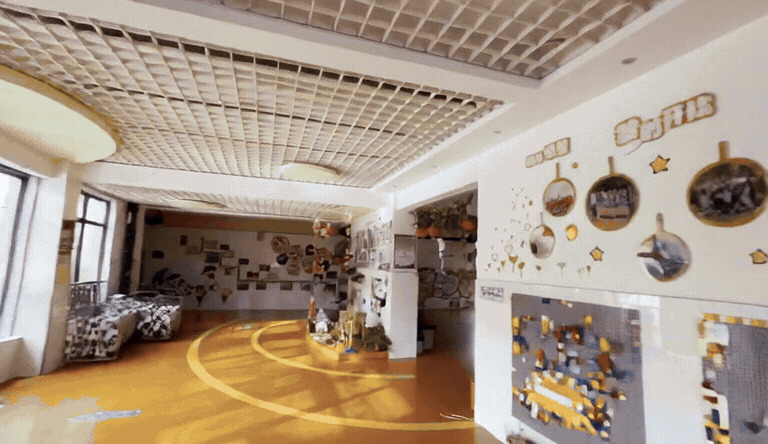
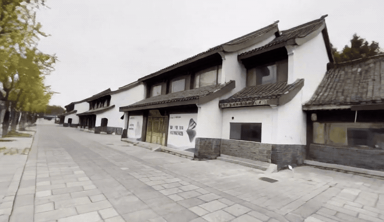

<p align="center">
  
</p>

<h1 align="center">MosaiChunk</h1>
<p align="center"><strong>Compositing Spatio-Temporal Memory for Autoregressive Video Generation</strong></p>

<p align="center">
  <a href="https://arxiv.org/abs/2610.02153"></a>
  <a href="https://mosaichunk.github.io/"></a>
  <a href="https://huggingface.co/datasets/mosaichunk/RememBench"></a>
  <a href="https://huggingface.co/mosaichunk/MosaiChunk"></a>
  <a href="https://mosaichunk.github.io/viewer/video.html"></a>
</p>

## Introduction

**MosaiChunk** is a spatio-temporal memory mechanism for autoregressive video generation. When an object or scene leaves a model's sliding window, its visual details can be lost when it reappears. MosaiChunk retrieves fine-grained historical key–value (KV) sections across space and time, and composes them into a compact memory for the current generation step.

Our approach keeps the video generator frozen and trains only a lightweight memory router through self-distillation. We also introduce **RememBench**, a benchmark for testing visual memory through prompt-driven revisits in text-to-video (T2V) and camera-driven revisits in image-to-video (I2V).

This repository provides router training, Base / MosaiChunk inference, and benchmark scoring for both backbones, together with links to the released [router checkpoints](https://huggingface.co/mosaichunk/MosaiChunk) and [RememBench inputs](https://huggingface.co/datasets/mosaichunk/RememBench). For coding agents, start with [AGENTS.md](AGENTS.md).

<table>
  <tr>
    <td align="center" width="50%"><strong>T2V · Boot tray</strong><br><a href="docs/media/t2v-15.mp4"></a></td>
    <td align="center" width="50%"><strong>T2V · Case thimble</strong><br><a href="docs/media/t2v-01.mp4"></a></td>
  </tr>
  <tr>
    <td align="center"><strong>I2V · Indoor room</strong><br><a href="docs/media/i2v-01.mp4"></a></td>
    <td align="center"><strong>I2V · Traditional street</strong><br><a href="docs/media/i2v-19.mp4"></a></td>
  </tr>
</table>

<p align="center">
  MosaiChunk · 2-chunk far memory · 3× previews<br>
  Click for full-resolution MP4: T2V 1376&nbsp;×&nbsp;768 · I2V 832&nbsp;×&nbsp;480<br>
  <a href="https://mosaichunk.github.io/viewer/video.html">Compare with baselines in the Video Viewer.</a>
</p>

| Split | Frozen generator | RememBench | Output per sample |
|---|---|---|---|
| T2V | RAVEN-adapted MiniMax-H3 (H3-AR) | 100 prompt schedules | 379 frames at 24 fps |
| I2V | LingBot-World-Infinity | 150 scenes; 750 scene–trajectory pairs | 253 frames at 16 fps |

## Setup

Use Linux with an NVIDIA driver compatible with CUDA 12.8, `git`, `ffmpeg`, and [uv](https://docs.astral.sh/uv/). T2V also needs the CUDA 12.8 toolkit to build attention extensions. The released T2V inference configuration uses **8 H200 GPUs**; I2V inference uses **1 H200**. The backbones have separate Python environments.

Run all commands from the repository root:

```bash
git clone https://github.com/mosaichunk/MosaiChunk.git
cd MosaiChunk
```

### 1. Install the environment

Choose the split you need, or install both:

```bash
python scripts/setup.py --split i2v   # creates .venv-i2v (Python 3.11)
python scripts/setup.py --split t2v   # creates .venv-t2v (Python 3.10)
```

[`setup.py`](scripts/setup.py) fetches pinned upstream code, applies the included patches, and installs the Python and attention dependencies. It does not install the system driver, CUDA toolkit, or FFmpeg, and does not download model weights or benchmark data. Package pins are in [`requirements/`](requirements/).

### 2. Download weights and benchmark inputs

**I2V:** initial-frame preparation requires your own access to [DL3DV](https://huggingface.co/datasets/DL3DV/DL3DV-ALL-960P). Log in with that account, then download:

```bash
source .venv-i2v/bin/activate
hf auth login
python scripts/download.py --split i2v --image-limit 3
```

This prepares the first three scenes for the examples below. Omit `--image-limit 3` to prepare all 150 scenes. Initial frames are retrieved from DL3DV and checked against the benchmark's image hashes.

**T2V:**

```bash
source .venv-t2v/bin/activate
python scripts/download.py --split t2v
```

[`download.py`](scripts/download.py) downloads fixed revisions into `assets/` and verifies router checksums:

| Download | Contents |
|---|---|
| Both splits | `RememBench/` inputs and `MosaiChunk/` router weights |
| T2V | `MiniMax-H3/` backbone and `MiniMax-H3-RAVEN-Streaming-LoRA/` adapter |
| I2V | `LingBot/` backbone and prepared conditioning frames |

The T2V streaming adapter is required in addition to the backbone and router. I2V training data is prepared separately, as described below. To use another storage location, pass the same `--assets /path/to/assets` to download, train, test, and score commands.

## Train

Training updates the descriptor encoder and its query/key projections. Teacher and student share the frozen generator, noise, denoising step, and local context; the teacher receives richer historical memory. The objective is MSE between their predictions, scaled by 100.

### T2V

The 2,000 four-segment training prompts are included in [`data/train/t2v/`](data/train/t2v/). Start a single-node, eight-GPU run with:

```bash
source .venv-t2v/bin/activate
python train.py --split t2v --nproc 8 --output outputs/train/t2v
```

The recipe uses 260 frames, four denoising steps, and AdamW at `1e-4`; `--steps` controls the number of optimizer steps (default: 4,000). Distributed checkpoints are saved under `outputs/train/t2v/mosaichunk/run/checkpoints/`.

### I2V

Prepare the Sekai clips named in [`data/train/i2v/clips.txt`](data/train/i2v/clips.txt) under a common directory. Each clip must have this layout:

```text
/path/to/prepared-sekai/
  CLIP_NAME/
    gt_frames/00000.png
    prompt.txt
    intrinsics.npy
```

Use an 832 × 480 initial frame and intrinsics `[fx, fy, cx, cy]` in that image's pixel coordinates. Preserve the manifest's clip names, which determine scene grouping and seeds. Source footage is not bundled; RememBench contains test inputs and must not be used for training.

```bash
source .venv-i2v/bin/activate
python train.py --split i2v --train-data /path/to/prepared-sekai \
  --nproc 8 --output outputs/train/i2v
```

The recipe uses 20 chunks, AdamW at `2e-4`, and two epochs. Checkpoints are saved under `outputs/train/i2v/run/`; resume with `--resume outputs/train/i2v/run/last.pt`.

The paper used **32 H200 GPUs for T2V training and 16 for I2V**. The single-node examples above use fewer GPUs. See [training details](docs/training.md) for the multi-node commands, data split, and complete recipes. Add `--dry-run` to either launcher to inspect the resolved inputs and command without loading models.

### Export a trained router

Export the learned router weights for testing:

```bash
python export.py --split i2v --source outputs/train/i2v/run/last.pt \
  --output outputs/router/i2v
```

For T2V, use its environment and `--split t2v`, and set `--source` to a distributed checkpoint directory. The frozen backbone weights are not included in the export. In the Test commands below, add `--checkpoint outputs/router/i2v/model.safetensors` to use your trained I2V router.

## Test

### Generate videos

These commands use the released routers and generate the first three benchmark samples for each method. Base and MosaiChunk share each scene's prompt and noise seed; I2V also shares the conditioning frame and input camera trajectory.

**I2V:**

```bash
source .venv-i2v/bin/activate
python test.py --split i2v --method base --limit 3 --output outputs/i2v/base
python test.py --split i2v --method mc   --limit 3 --output outputs/i2v/mc
```

**T2V:**

```bash
source .venv-t2v/bin/activate
python test.py --split t2v --method base --limit 3 --output outputs/t2v/base
python test.py --split t2v --method mc   --limit 3 --output outputs/t2v/mc
```

The default far-memory budget is **2 chunks**. MosaiChunk uses two recent chunks plus selected far memory; Base uses `2 + budget` recent chunks. Both retain the backbone's attention sink.

| Option | Purpose |
|---|---|
| `--budget 1` or `--budget 2` | Choose the far-memory budget; Base's window is adjusted to match. |
| `--limit N` | Run the first N samples; omit for all samples in the selected split/setting. |
| `--scene-ids ID ...` | Select benchmark scene IDs. |
| `--setting NAME` | I2V trajectory setting; default `rotation_180`. |
| `--checkpoint PATH` | Use an exported router instead of the released one. |

I2V settings are `rotation_90`, `rotation_180`, `rotation_360`, `translation_90`, `translation_180`, and `translation_360`. Rotation covers 150 scenes; translation covers the 100 outdoor scenes. Run each setting separately with a new output directory, and prepare its conditioning frames first.

Each run saves `run.json`, `samples.json`, resolved inputs, videos, and latents. MP4 locations relative to `--output` are:

- **I2V:** `videos/<sample_id>/rollout.mp4`
- **T2V:** `mosaichunk/run/media/**/promptNNNN.mp4` (indices follow `samples.json`)

Use an empty output directory for each run. Running all four examples produces **12 videos**: three scenes × two methods × two splits.

### Compute test metrics

Install the metric dependencies and download their weights once. Scoring for **both splits** uses the I2V environment:

```bash
python scripts/setup.py --split i2v --metrics
source .venv-i2v/bin/activate
python scripts/download.py --split i2v --metrics --image-limit 3
```

For I2V, Pi3X reconstructs each output video's camera poses to select the revisit frame automatically:

```bash
python score.py --run outputs/i2v/base
python score.py --run outputs/i2v/mc
```

For T2V, mark departure/revisit frames in each generated video and supply a JSON mapping from scene ID to zero-based frame indices:

```json
{
  "SCENE_ID": {"departure_frame": 72, "revisit_frame": 264}
}
```

Replace the example ID and frame indices with your annotations. Use a separate file for each method:

```bash
python score.py --run outputs/t2v/base --pairs pairs-base.json
python score.py --run outputs/t2v/mc   --pairs pairs-mc.json
```

Alternatively, `--paper-pairs` loads the published annotations when the generated rollouts match those annotations. Each command writes per-scene **CLIP / LPIPS** and their medians to `scores.json` in the run directory. Add `--quality` for Temporal SSIM and Drift. Score the original generated MP4s; see [evaluation details](docs/evaluation.md) for frame selection and metric definitions.

## License

The code and router checkpoints are subject to the license of the backbone they are used with:

| Setting | Backbone | License |
|---|---|---|
| I2V | LingBot-World-v2 | [CC BY-NC-SA 4.0](https://creativecommons.org/licenses/by-nc-sa/4.0/) |
| T2V | MiniMax-H3 with RAVEN | [MiniMax-H3 Community License Agreement](https://huggingface.co/MiniMaxAI/MiniMax-H3/blob/main/LICENSE); RAVEN: [CC BY-NC 4.0](https://creativecommons.org/licenses/by-nc/4.0/) |

[RememBench](https://huggingface.co/datasets/mosaichunk/RememBench) is released under [CC BY 4.0](https://creativecommons.org/licenses/by/4.0/). Third-party components are listed in [NOTICE.md](NOTICE.md).

## Citation

```bibtex
@misc{zhang2026mosaichunkcompositingspatiotemporalmemory,
      title={MosaiChunk: Compositing Spatio-Temporal Memory for Autoregressive Video Generation},
      author={Yiwen Zhang and Haocheng Xi and Michael Tian-Yue Liu and Alexei A. Efros and Hadar Averbuch-Elor and Qianqian Wang and Haiwen Feng},
      year={2026},
      eprint={2610.02153},
      archivePrefix={arXiv},
      primaryClass={cs.CV},
      url={https://arxiv.org/abs/2610.02153},
}
```
